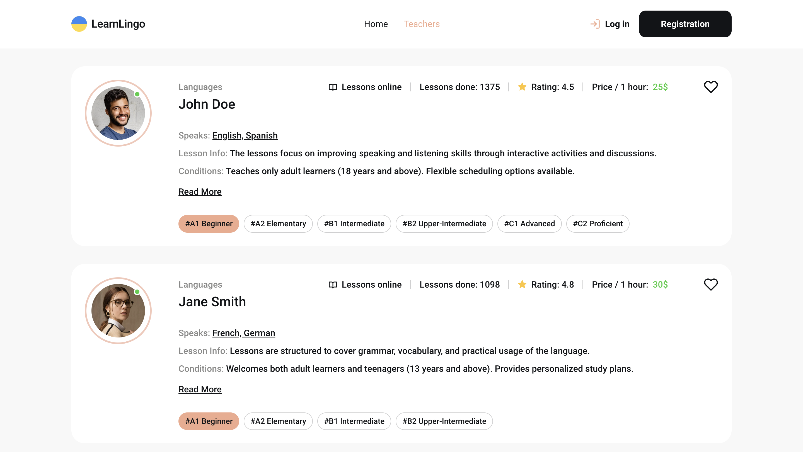
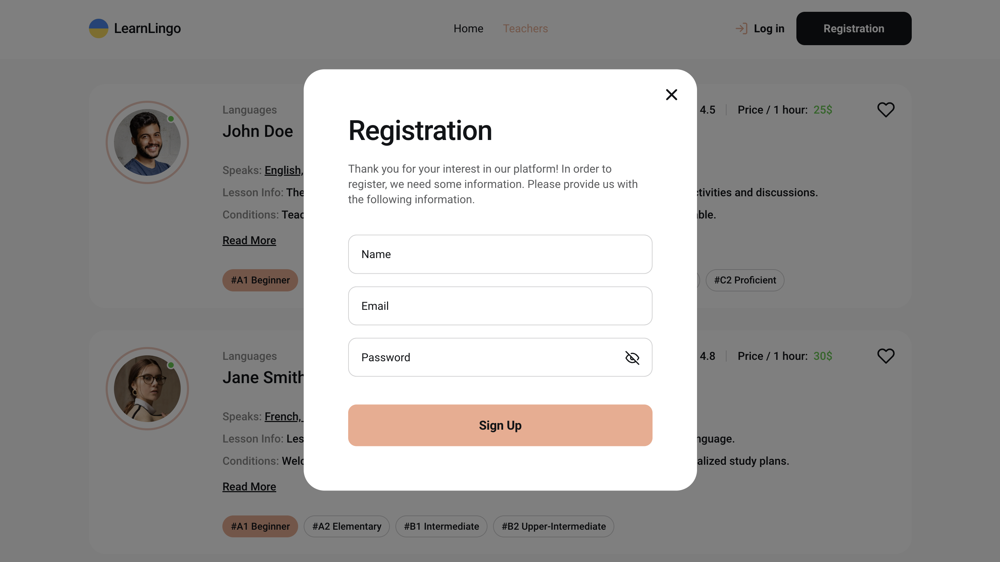
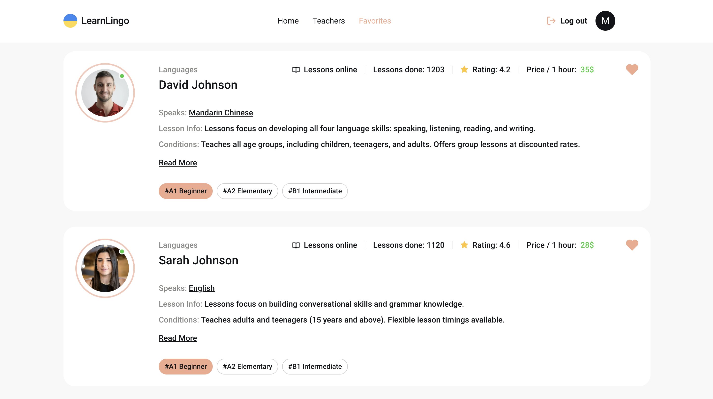
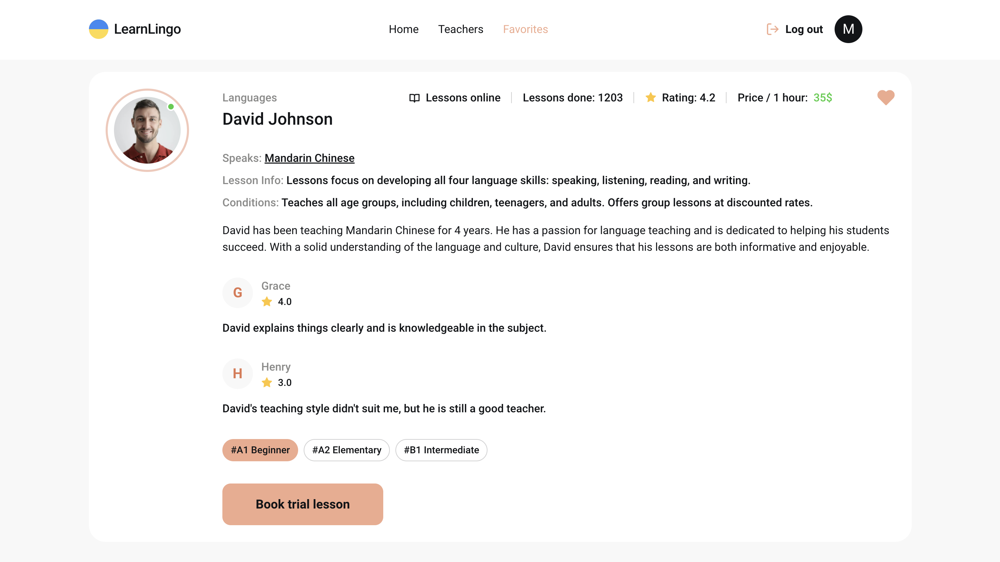

# LearnLingo

[Live Site](https://top-learn-lingo.vercel.app/)

[Technical task](https://docs.google.com/document/d/1ZB_MFgnnJj7t7OXtv5hESSwY6xRgVoACZKzgZczWc3Y/edit)

[Layout](https://www.figma.com/file/dewf5jVviSTuWMMyU3d8Mc/%D0%9F%D0%B5%D1%82-%D0%BF%D1%80%D0%BE%D1%94%D0%BA%D1%82-%D0%B4%D0%BB%D1%8F-%D0%9A%D0%A6?type=design&node-id=0-1&mode=design&t=jCmjSs9PeOjObYSc-0)

## Overview

LearnLingo is an educational platform designed to help users find and book language tutors from around the world. With a diverse range of experienced tutors, subjects, and nationalities, Learn Lingo makes language learning accessible and personalized.

## Main sections

**Home page:**


**Teachers' page:**



**User registration and authorization:**




**Favorite teachers page. Available to authorized users:**



**Full information about the teacher and reviews:**



**A convenient form of registration for a trial lesson:**


## Features

- **Search for Tutors:** Users can browse through a wide range of language tutors.
- **Tutor Reviews:** Access thousands of reviews from other students to help in decision-making.
- **Responsive Design:** The application is optimized for mobile, tablet, and desktop devices. Markup from 320px to 1440px.
- **Favorites:** Users can add their preferred tutors to a favorites list.
- **Booking System:** Book a session with a tutor directly from the app.

## Technologies Used

- **Frontend:**

  - React
  - Redux Toolkit for state management
  - React Router for navigation
  - Vite for fast development and build
  - Material UI for styling

- **Backend:**
  - Firebase Authentication for user authentication
  - Firebase Realtime Database for storing tutor and booking data

## Getting Started

To run the project locally, follow these steps:

1. Clone the repository:

   ```bash
   git clone https://github.com/MykhailoVobolis/learn-lingo.git
   ```

2. Navigate to the project folder:

   ```bash
   cd learn-lingo
   ```

3. Install the dependencies:

   ```bash
   npm install
   ```

4. Create a `.env` file in the root directory with the following Firebase credentials:

   ```bash
   VITE_FIREBASE_API_KEY=your-api-key
   VITE_FIREBASE_AUTH_DOMAIN=your-auth-domain
   VITE_FIREBASE_DATABASE_URL=your-database-url
   VITE_FIREBASE_PROJECT_ID=your-project-id
   VITE_FIREBASE_STORAGE_BUCKET=your-storage-bucket
   VITE_FIREBASE_MESSAGING_SENDER_ID=your-messaging-sender-id
   VITE_FIREBASE_APP_ID=your-app-id
   VITE_FIREBASE_MEASUREMENT_ID=your-measurement-id
   ```

5. Run the development server:

   ```bash
   npm run dev
   ```

6. Open [http://localhost:5173](http://localhost:5173) to view it in the browser.
