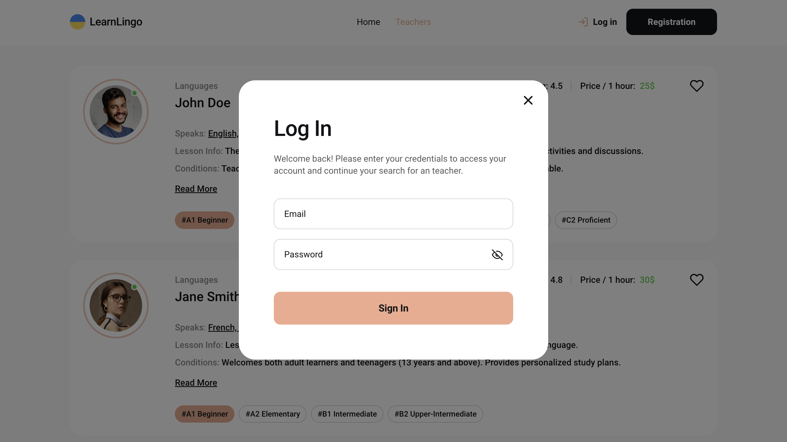

# LearnLingo

[Жива сторінка](https://top-learn-lingo.vercel.app/)

## Огляд

LearnLingo — це освітня платформа, яка допомагає користувачам знаходити та бронювати уроки з викладачами мов з усього світу. Завдяки різноманіттю досвідчених викладачів, предметів та національностей, Learn Lingo робить вивчення мов доступним та індивідуалізованим.

## Основні розділи

**Домашня сторінка:**


**Cторінка вікладачів:**


**Реєстрація та авторизація користувачів:**




**Сторінка обраних викладачів. Доступна авторизованим користувачам:**


**Повна інформація про викладача та відгуки:**


**Зручна форма запису на пробне заняття:**


## Особливості

- **Пошук викладачів:** Користувачі можуть переглядати великий вибір викладачів мов.
- **Відгуки про викладачів:** Доступ до тисяч відгуків від інших студентів для прийняття рішення.
- **Адаптивний дизайн:** Додаток оптимізовано для мобільних пристроїв, планшетів і настільних комп'ютерів.
- **Обране:** Користувачі можуть додавати улюблених викладачів у список обраного.
- **Система бронювання:** Бронюйте уроки з викладачем безпосередньо через додаток.

## Використані технології

- **Фронтенд:**

  - React
  - Redux Toolkit для управління станом
  - React Router для навігації
  - Axios для API запитів
  - Vite для швидкої розробки та збірки
  - Material UI для стилізації

- **Бекенд:**
  - Firebase Authentication для автентифікації користувачів
  - Firebase Realtime Database для зберігання даних про викладачів та бронювання

## Початок роботи

Щоб запустити проект локально, виконайте наступні кроки:

1. Клонуйте репозиторій:

   ```bash
   git clone https://github.com/MykhailoVobolis/learn-lingo.git
   ```

2. Перейдіть до папки проекту:

   ```bash
   cd learn-lingo
   ```

3. Встановіть залежності:

   ```bash
   npm install
   ```

4. Створіть файл `.env` у кореневій директорії з такими даними Firebase:

   ```bash
   VITE_FIREBASE_API_KEY=your-api-key
   VITE_FIREBASE_AUTH_DOMAIN=your-auth-domain
   VITE_FIREBASE_DATABASE_URL=your-database-url
   VITE_FIREBASE_PROJECT_ID=your-project-id
   VITE_FIREBASE_STORAGE_BUCKET=your-storage-bucket
   VITE_FIREBASE_MESSAGING_SENDER_ID=your-messaging-sender-id
   VITE_FIREBASE_APP_ID=your-app-id
   VITE_FIREBASE_MEASUREMENT_ID=your-measurement-id
   ```

5. Запустіть сервер розробки:

   ```bash
   npm run dev
   ```

6. Відкрийте [http://localhost:5173](http://localhost:5173), щоб переглянути в браузері.
